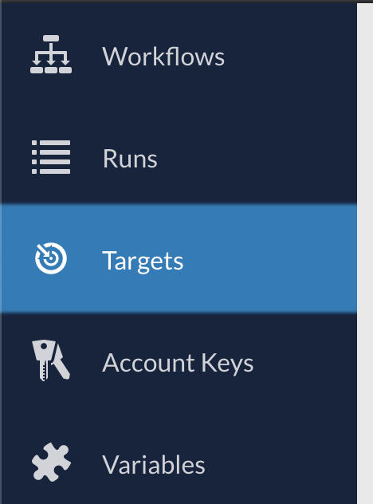
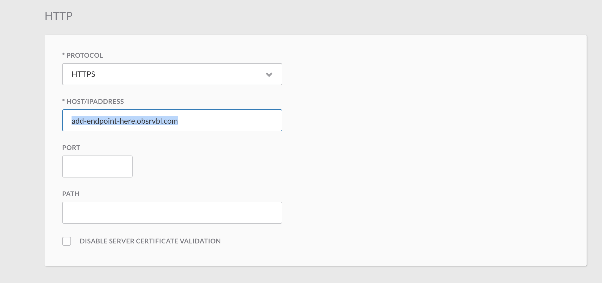
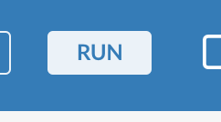
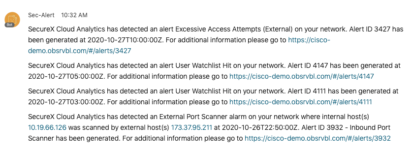
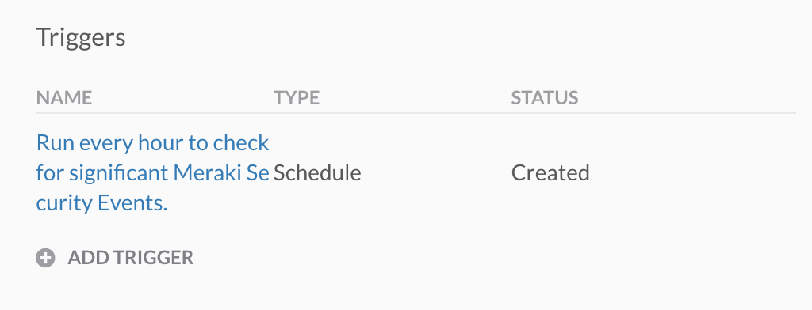

# secureX-swc-detailed-alert-wf

This Cisco SecureX orchestration workflow is very similar to my ["Stealthwatch Cloud - Webex Teams Alerts"](https://github.com/emcnicholas/secureX-swc-wxt-alert-wf) workflow. In this workflow we are only creating a custom Webex Teams message for the **Inbound Port Scanner** alerts, but also creating a generic alert message for all other Alert Types. The idea here is to get started with creating more detailed alerts messages for attacks that mean more to your organization, while still have the generic alerts for all others, until a customized message is needed.

## SecureX Stealthwatch Cloud Detailed Alert Workflow

**Prerequisites:**
1. Cisco Stealthwatch Cloud (SWC) Account (and API key)
2. Cisco SecureX Account (and API key)
3. Cisco Webex Teams Account (and API key)

## Installation Steps
Please follow the below steps exactly to get started!

1. Browse to your SecureX orchestration instance. This will be a different URL depending on the region your account is in: 

* US: https://securex-ao.us.security.cisco.com/orch-ui/workflows/
* EU: https://securex-ao.eu.security.cisco.com/orch-ui/workflows/
* APJC: https://securex-ao.apjc.security.cisco.com/orch-ui/workflows/

2. Click on **IMPORT** to import the workflow:

3. Click on **Browse** and copy paste the content of the [secureX-swc-detailed-alert-wf.json](https://raw.githubusercontent.com/emcnicholas/secureX-swc-detailed-alert-wf/main/SecureX%20Cloud%20Analytics%20Demo%20Workflow%20Shared.json) file inside of the text window. 

4. Click on **IMPORT**.

5. Next we will need to fill some API keys and details before we can run this workflow. 

6. First let's update **SWC_Target**. On the main page of Orchestration, go to **Targets**, select **SWC_Target**, and change the host to your SWC base url. Please retrieve you base URL by looking at the URL of your SWC portal. For example if your URL was https://acme.obsrvbl.com/v2/#/settings/site/api-credentials, then you would need **acme.obsrvbl.com/api/v3/** as your base URL target (**SWC_Target**).

 7. Next up we will go back into the imported workflow, and we will update the **swc_api_key**. In the **SecureX Cloud Analytics Demo** workflow global workflow properties, scroll down to **Variables**, select the **swc_api_key** variable, and enter your API key in the Value field and save. Please retrieve your SWC API key by loging in to your SWC portal and generate an API key for your use account. To generate an API key, login to your portal and select **Settings > Account Management > API Credentials**, from there, you can generate a unique API key. A key is tied to a specfic user account.

> **Note:** make sure not to select an activity when looking for the global workflow properties.

 8. Now we need to update the **wxt_access_token**. Select the **wxt_access_token** variable, and enter your token in the Value field and save. Please retrieve your Webex key from: [https://developer.webex.com/docs/api/getting-started](https://developer.webex.com/docs/api/getting-started). Please be aware that the personal token from the getting started page only works for 12 hours. Please follow these steps to request a "bot" token: https://developer.webex.com/docs/integrations.

9. Finally we need to update the **wxt_room_id** variable. Select the **wxt_room_id** variable, and enter your Webex Teams room id in the Value field and save. Please retrieve the Webex room ID by creating a new space or finding an existing one via these link: https://developer.webex.com/docs/api/v1/rooms/list-rooms. You can also add the **roomid@webex.bot** bot to the room and it will send you the roomId in a private message and then remove itself from the room.

10. Now it is time to test, click on **RUN** in the top right of your window, and eveyrhting shopuld be working now. If not try troubleshooting by click on the activity that is colored red. 

11. If successfull, you should receive a Webex Team Message in the space you configured above similar to the following

12. As a final step you could choose to enable to scheduled trigger for this workflow. This is recommended, as the workflow only retrieves the security events of the last hour. By scheduling it, the Security analysts will be updated every hour for potential new malicious activity. To enable the trigger, click on the hyperlink below and uncheck the `DISABLE TRIGGER` checkbox. This can be found in the workflow properties in the right menu pane. 

> **Note:** make sure not to select an activity when looking for the global workflow properties.

## Notes

* Please test this properly before implementing in a production environment. This is a sample workflow!
* The roadmap will include a webhook based trigger, instead of a scheduled run. 

## Author(s)

* Ed McNicholas (Cisco)
* Christopher van der Made (Documentation Only) (Cisco)

